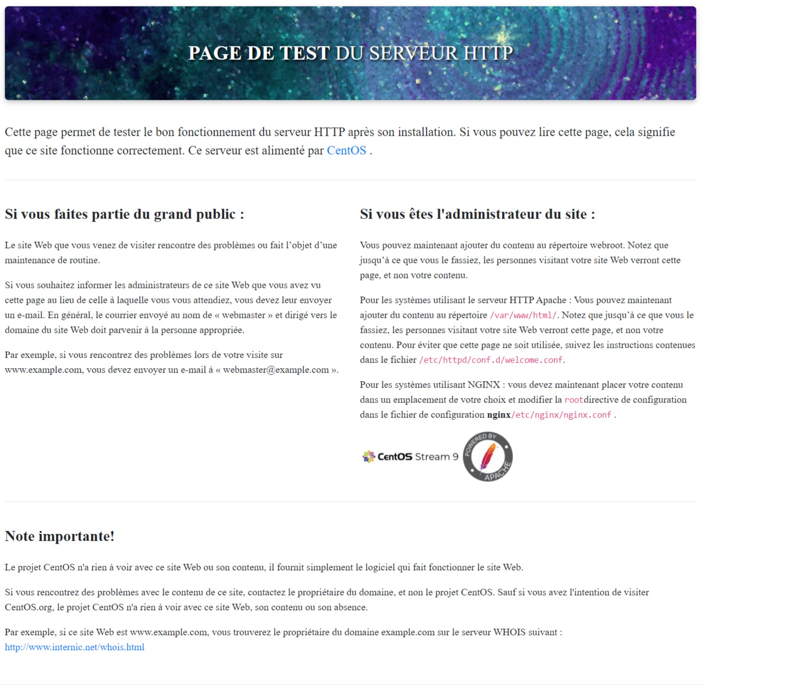
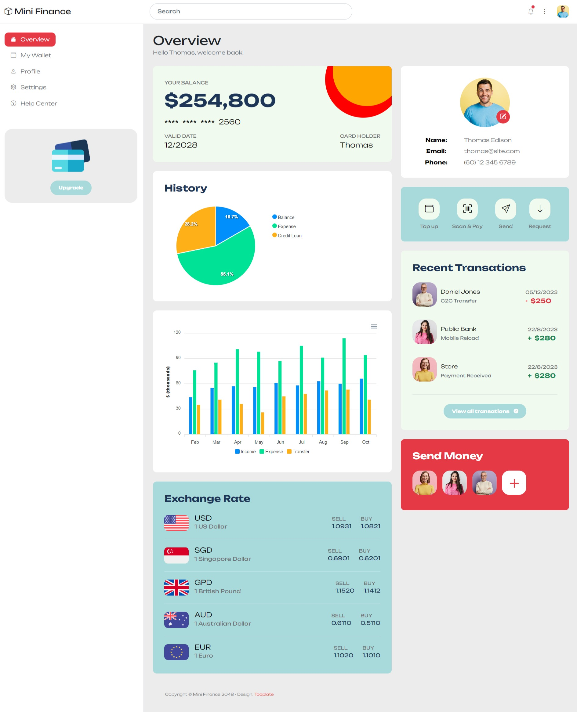
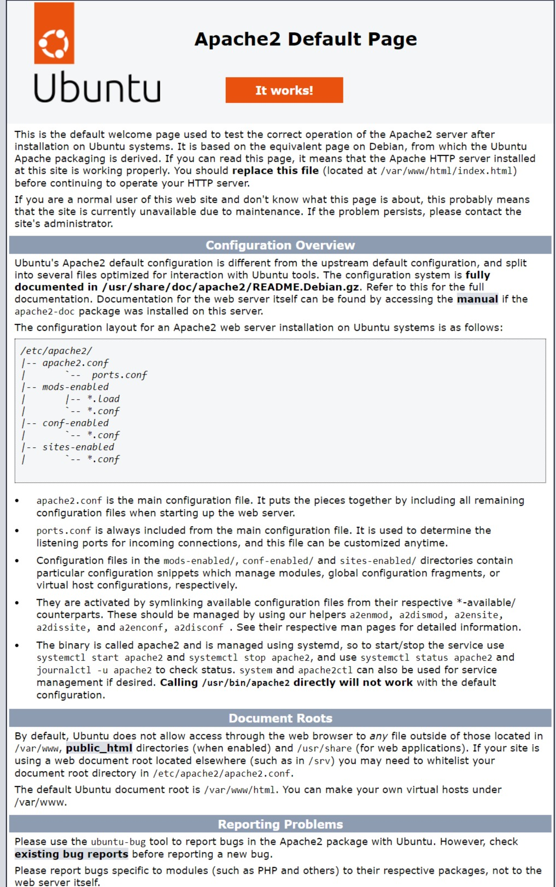
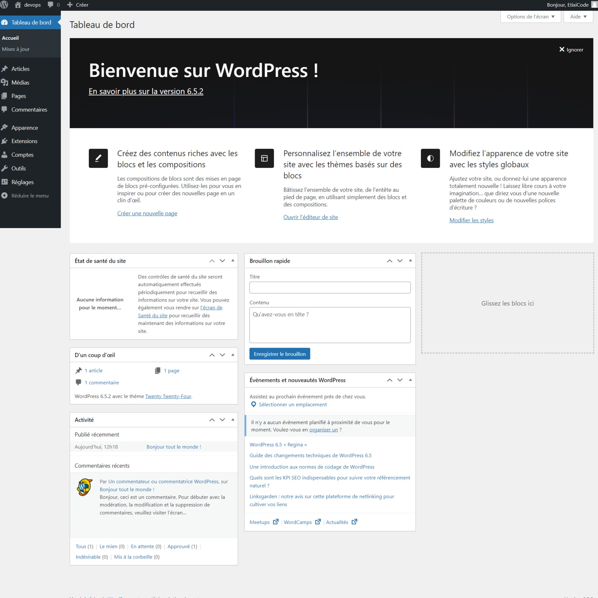

# **Vagrant & Linux Servers**

|PLAN|
|-----------------------------------|
|Vagrant-VMS|
|IP, RAM et CPU vagrant|
|Répertoires de synchronisation vagrant|
|Approvisionnement|
|Configuration du site Web|
|Configuration de Wordpress|
|Automatisez la configuration du site Web|
|Automatiser la configuration de Wordpress|
|Fichier Vagrant multi-VM|
|Quiz 16 : Quiz IAC|

### Configuration de Wordpress

|PLAN DE CONFIGURATION WORDPRESS|
|----|
|Aperçu|
|Installer les dépendances|
|Installer WordPress|
|Configurer Apache pour WordPress|
|Configurer la base de données|
|Configurer WordPress pour se connecter à la base de données|
|Configurer WordPress|
|Écrivez votre premier message|
|C'est tout!|

#### Centos : Configuration et Installation Service HTTPD  Et Déploiement de quelques templates HTML (Manuel et Automatique)

**Déploiement d'un site prêt à l'emploi**

+ [tooplate](https://www.tooplate.com/)

+ copier l'IP Address et coller sur n'importe quel navigateur

#### Ubuntu : Configuration d'une application LAMP (Linux, Apache, MySQL, PHP) (Manuel et Automatique)

**[Configuration de Wordpress](Commandes/commands_install_and_configure_wordpress.txt)**

|PLAN DE CONFIGURATION WORDPRESS|
|----|
|Aperçu|
|Installer les dépendances|
|Installer WordPress|
|Configurer Apache pour WordPress|
|Configurer la base de données|
|Configurer WordPress pour se connecter à la base de données|
|Configurer WordPress|
|Écrivez votre premier message|
|C'est tout!|

**Déploiement d'un modèle wordpress**

### **QUIZZ IAC**

**Question 1 :**
+ `L'infrastructure en tant que code (IaaC)` est le processus de gestion et de provisionnement de l'infrastructure (réseaux, machines virtuelles, équilibreurs de charge et topologie de connexion) via des fichiers `CODE/config`.***
  + Par exemple
    + Vagrant pour Terraform local pour Cloud
    + Ansible pour les serveurs
    + Cloudformation pour AWS*
    + etc.

      + VRAI

#### **Question 2 :**
+ Le provisionnement est le processus de configuration et de déploiement d'une ressource système de technologie de l'information (TI), soit localement, soit dans le cloud. Dans l'informatique d'entreprise, le terme est souvent associé aux machines virtuelles (VM) et aux instances de ressources cloud.
  + `VRAI`

